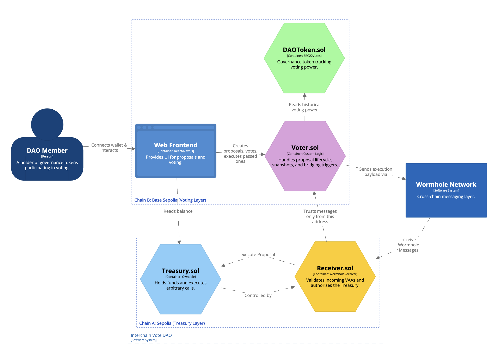

# Interchain Vote DAO

This project is a **Decentralized Multi-Chain Governance System** built using **Scaffold-ETH-2** and **Wormhole**.

It solves the problem of high gas costs in DAO governance by separating the **Voting Layer** from the **Execution Layer**. Members vote cheaply on an L2 (Base Sepolia), and the results are trustlessly relayed to execute transactions on the main treasury chain (Sepolia).

## 🌐 Concept

1. **Treasury (Chain A - Sepolia):** Holds the high-value assets (ETH, USDC, ...). It is controlled exclusively by the governance system.
    
2. **Voting (Chain B - Base Sepolia):** Users hold `DAOToken` and vote on proposals here to minimize gas fees.
    
3. **Bridge (Wormhole):** Once a proposal passes on Chain B, a verified message (VAA) is sent to Chain A to trigger the execution.
    

## 📂 Smart Contracts



### Chain A: Sepolia (Treasury Layer)

- **`Treasury.sol`**: Holds the DAO's funds. It contains an `executeProposal` function that allows arbitrary transactions (transfers, contract calls) but can only be called by the `Receiver` contract.
    
- **`Receiver.sol`**: The entry point for the Wormhole Relayer. It verifies that the message originated from the official `Voter` contract on Base Sepolia before triggering the Treasury.
    

### Chain B: Base Sepolia (Voting Layer)

- **`DAOToken.sol`**: An ERC20 token implementing `ERC20Votes` for snapshot-based voting power.
    
- **`Voter.sol`**: Manages the proposal lifecycle. It takes a snapshot of voting power, tallies votes, and if passed, encodes the execution data to send across the Wormhole Relayer.
    

## 🚀 Getting Started

### Prerequisites

- [Node.js](https://nodejs.org/) (>= v18.17)
    
- Yarn
    
- Git
    

### Installation

1. Clone the repository:
    
    Bash
    
    ```
    git clone <your-repo-url>
    cd <your-repo-name>
    ```
    
2. Install dependencies:
    
    Bash
    
    ```
    yarn install
    ```
    

### Configuration

This project requires deployment to two different networks. Ensure your `.env` file contains a deployer private key with funds on both **Base Sepolia** and **Sepolia**.

## 📖 Usage Guide

### 1. Minting & Delegation (Base Sepolia)

Users must hold the `DAOToken` to participate.
    
- **Important:** `ERC20Votes` requires delegation. Ensure you delegate votes to yourself (or another address) to activate your voting power.
    

### 2. Creating a Proposal (Base Sepolia)

Navigate to the "Governance" tab. You can propose:

- **ETH Transfer:** Send Native ETH from the Treasury on Sepolia.
    
- **ERC20 Transfer:** Send USDC (or other tokens) from the Treasury.
    
- **Custom Call:** Execute any arbitrary smart contract function on Sepolia.
    

Note: The system takes a snapshot of your voting power at the exact block the proposal is created.

### 3. Voting (Base Sepolia)

Users vote "For" or "Against".

- This transaction is cheap as it occurs on Base Sepolia.
    
- Voting stays open for a defined period (default 15 blocks for demo purposes).
    

### 4. Execution & Bridging (The "Wait")

Once the voting period ends and the proposal passes:

1. Click **Execute** on the frontend.
    
2. This calls `finalizeAndSend` on the `Voter` contract.
    
3. The contract sends the instruction to the Wormhole Relayer.
    

> **⚠️ WORMHOLE FINALITY WARNING:** To ensure security, Wormhole waits for "Finality" on the source chain before emitting the message to the destination chain. On Base Sepolia/Sepolia, **this process typically takes 18 to 20 minutes.**
> 
> Please do not panic if the Treasury on Sepolia does not update immediately. You can monitor the Wormhole Scan explorer using the transaction hash generated by the `finalizeAndSend` action.

## 🛠 Tech Stack

- **Scaffold-ETH-2:** NextJS, RainbowKit, Wagmi, Viem.
    
- **Solidity:** Smart contracts for governance and treasury logic.
    
- **Wormhole SDK:** For cross-chain message passing.